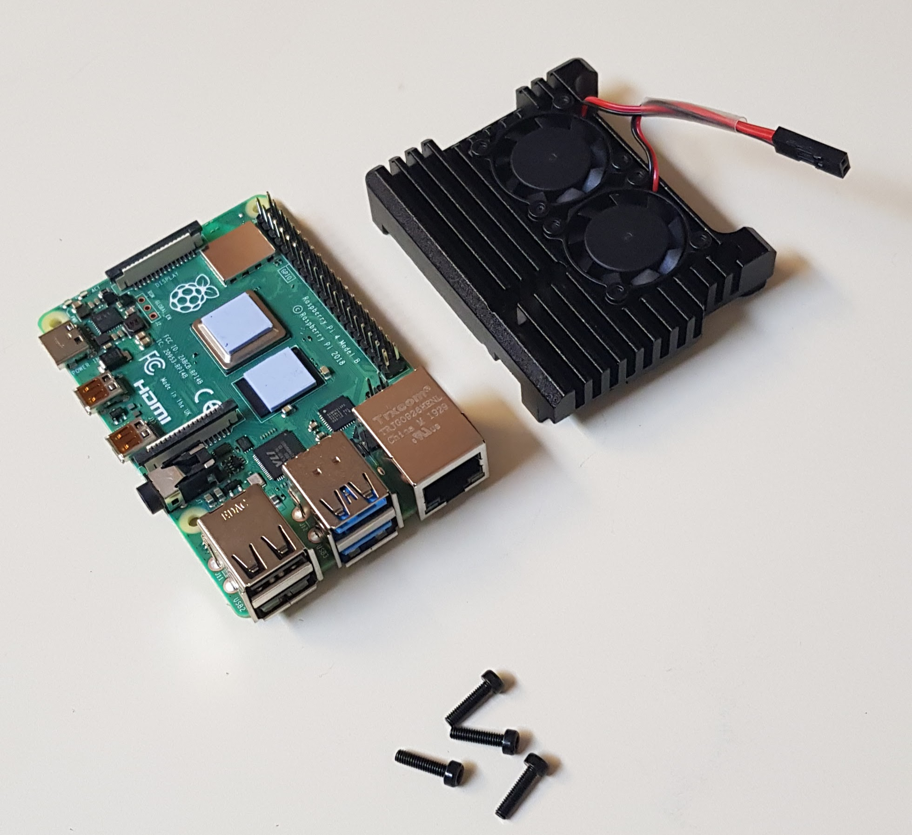
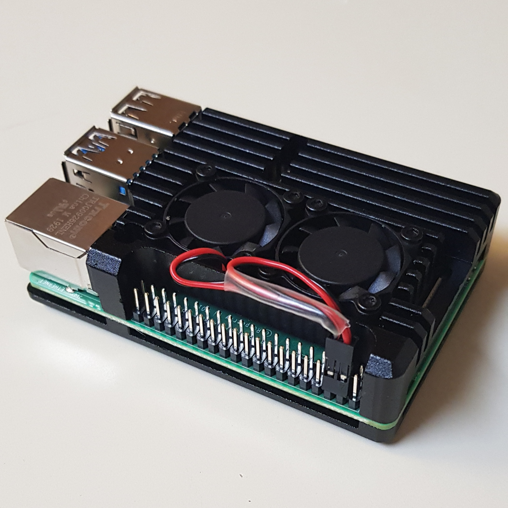
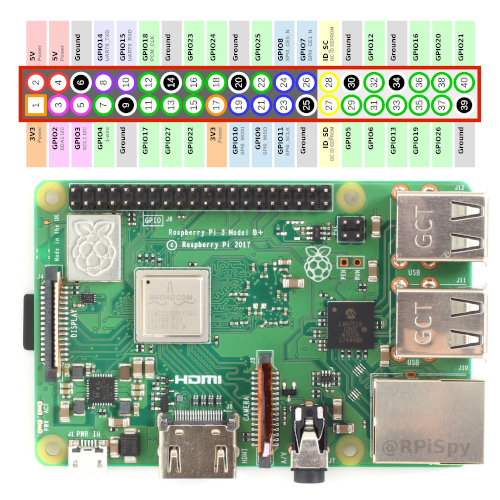

# mc-server
A portable server solution for [Minecraft](https://www.minecraft.net/)

## Table of Contents
1. [Goal](#goal)
2. [Hardware](#hardware)
3. [Software](#software)

## Goal <a name="goal"></a>
The purpose of this project is to create a self-sufficient portable Minecraft server on an independently controlled piece of hardware. Modern Minecraft servers are usually hard to manage because the host server is unable to stay online 24/7, or, when run with other programs, slow down the server. Backing up is also a prominent issue, and a lot of data is lost due to crashes, malfunctions, or poor online ediquette from users.

With this solution, I hope to create a standalone portable server that runs freely of any other programs, allowing the server full control of the memory and cpu. This standalone solution only needs power and internet, and backups for the previous six months will stored once every week.

## Hardware <a name="hardware"></a>

The server hardware consists of the following products. Including tax, the total cost was around $135.

> Note that this list of products does not include an ethernet cable or an HDMI display, both of which I already owned.

> I also purchased a standard Raspberry Pi Black Case for $5, which, to my dismay, does not fit the heat sink.

- [Raspberry Pi 4 Computer Model B (4GB RAM)](https://www.raspberrypi.org/products/raspberry-pi-4-model-b/) - $50
  
  

- Raspberry Pi USB-C Power Supply - $8

  

- Adafruit [4340] Aluminum Metal Heatsink Raspberry Pi 4 Case with Dual Fans - $25

  

- Raspberry Pi Micro HDMI Cable - $9

  

- Verbatim microSDXC With Adapter (64GB) - $9

  

- Logitech K400 Wireless Touch Keyboard - $20

  

The steps below are the steps I followed to setup up the Raspberry Pi.

1. Screw the fans down into the heat sink. It's important to notice that there are two types of screws. The flatter-head screws are used to attach the fans to the heat sink.

2. Place the thermal pads on the cpu.

    

3. Screw the heat sink and the base into the Pi. The fan pins connect to power and ground, respectively.

    
    

## Software <a name="software"></a>

The steps below are the steps I followed to setup up the operating system, backups, and start the server.

1. Go to [ubuntu.com/download/raspberry-pi](https://ubuntu.com/download/raspberry-pi) to download Ubuntu Server 64-bit and put the image on the microSD card. The version I used is 19.10.1. The instructions for imaging the SD card are provided on the page, but those instructions didn't seem to work for me. Instead, I used (and recommend) [BalenaEtcher](https://www.balena.io/etcher/) to write the image to the SD card.

2. Connect the SD card, display, and keyboard to the Pi. Connect an ethernet cable to the back of the modem, or router. Finally, connect power. One of the power lights will be red whilst the other blinks green periodically (signifiying that it is reading the SD card).
    I had a few issues with the TV display not detecting the Pi. After disconnecting and reconnecting both the power and display cables, it seems to have booted and displayed on the screen.
3. Eventually terminal output will come to a stop, and it will prompt for a username and password (in my case, it printed some dmesg info after it prompted for my username). Enter `ubuntu` for both the username and password. It will ask you to change the password.
4. Install Java 8 JDK.
    ```bash
    sudo apt-get install openjdk-8-jre-headless
    ```
    You can verify installation with `java -version`.
5. Create a folder from which to store backups.
    ```bash
    mkdir backup
    ```
6. Next, create a service called [`minecraftserver.service`](minecraftserver.service). This service runs the minecraft server script on startup. You can download both and place them in the proper locations with the following command:
    ```bash
    curl https://github.com/bossley9/mc-server/README.md    
    ```
