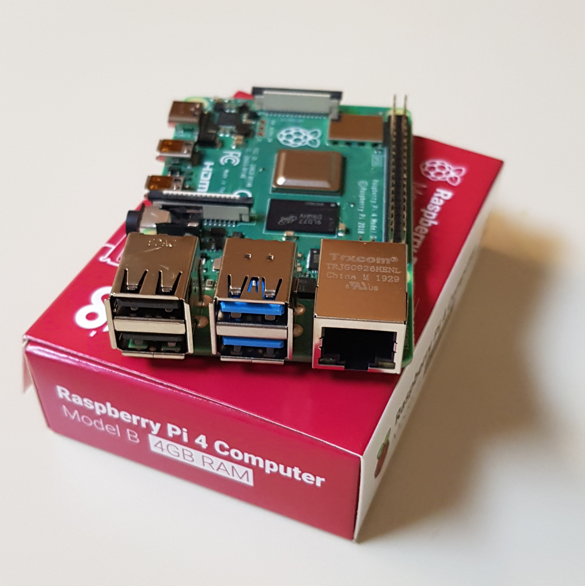
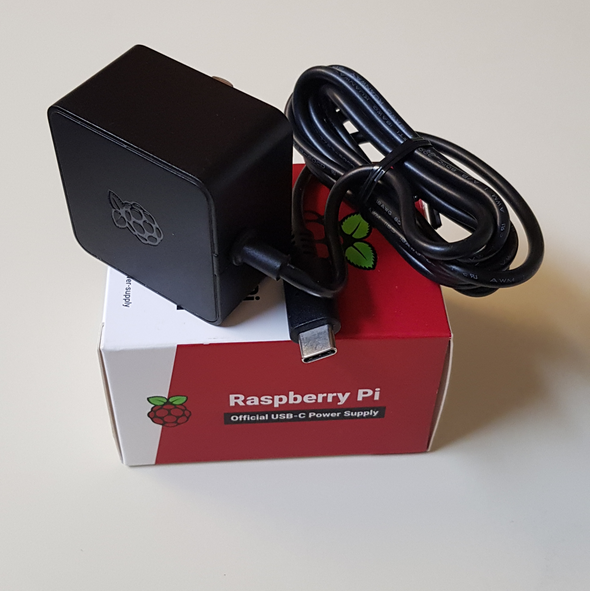
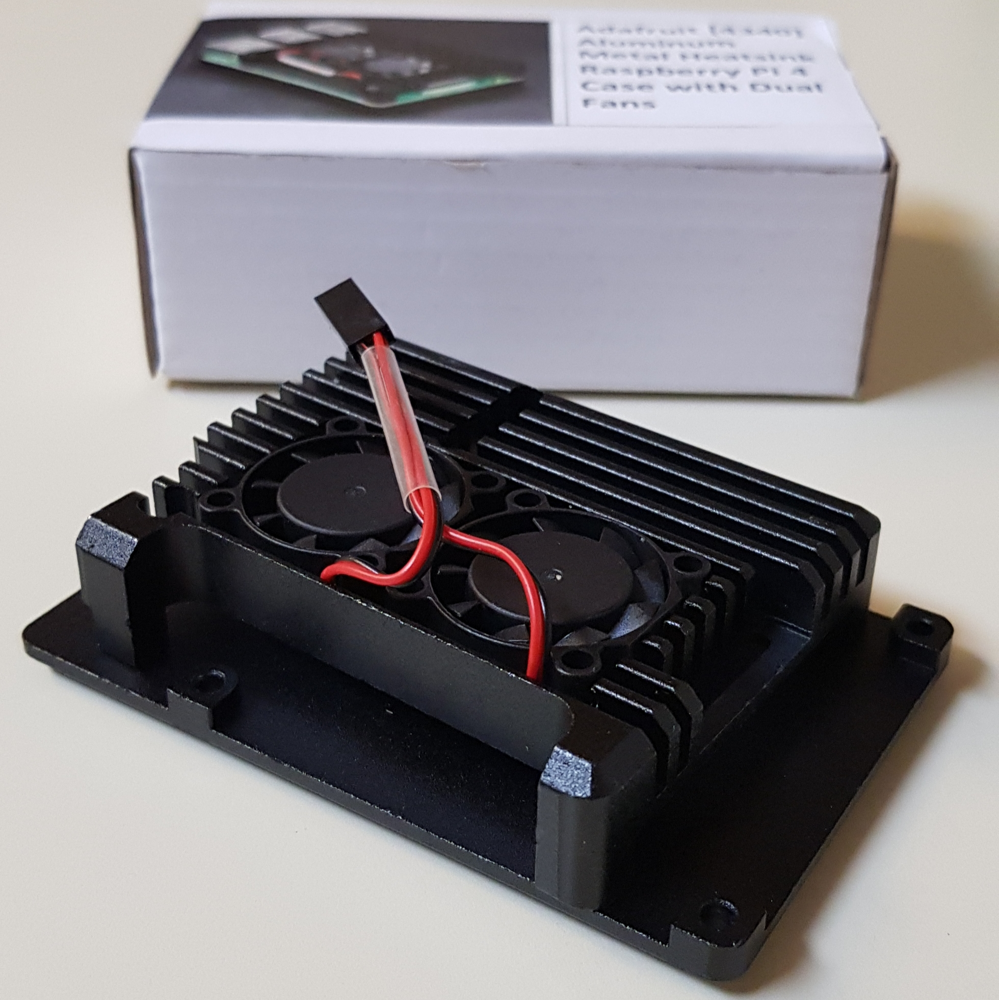
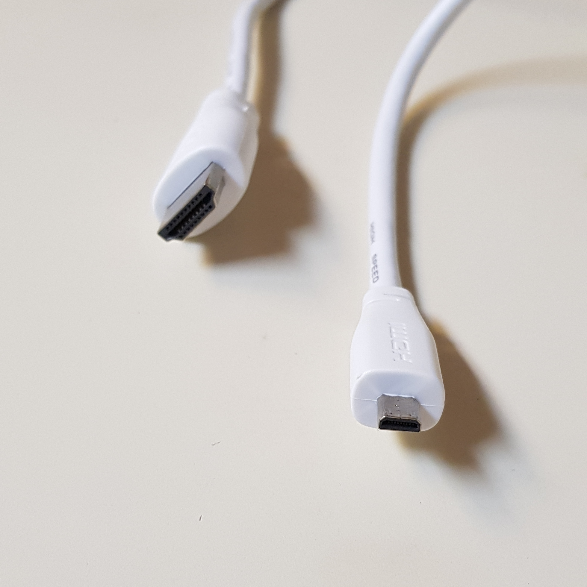
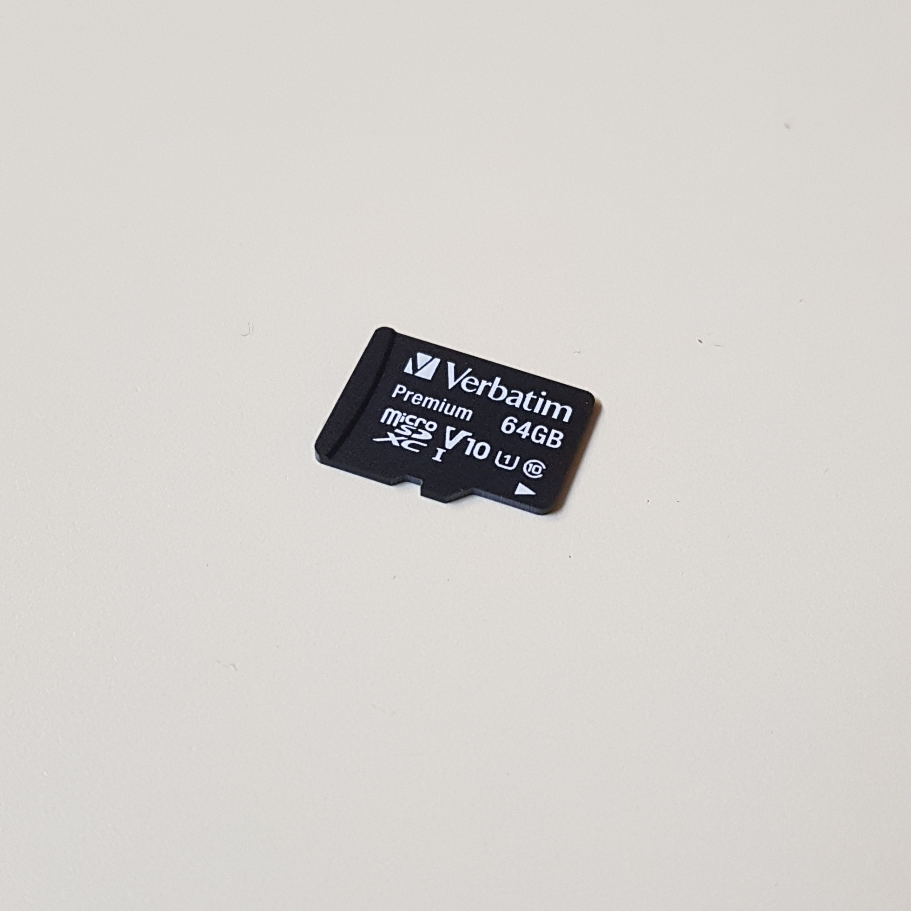
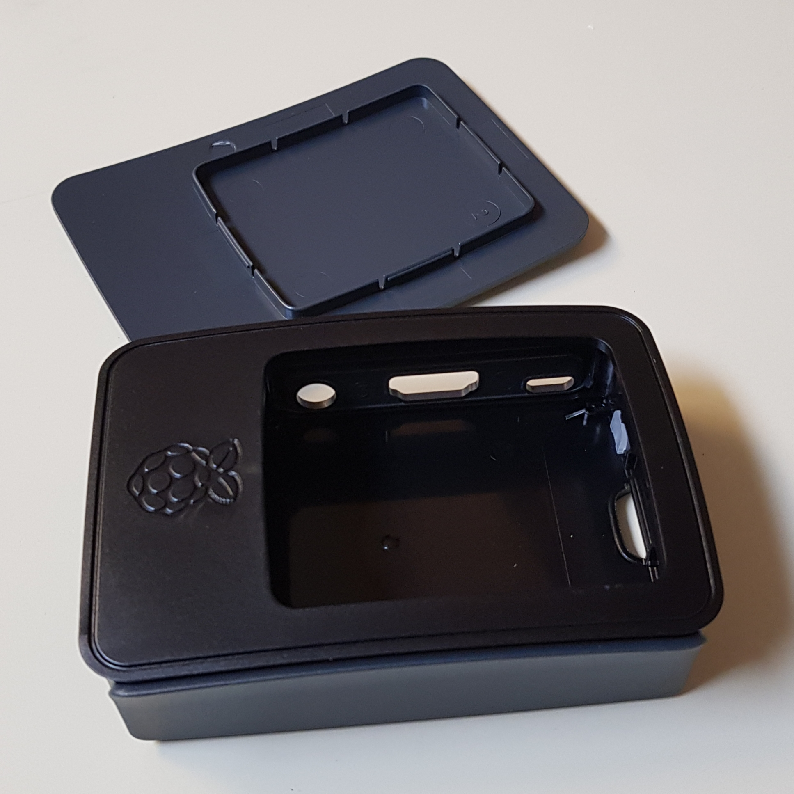
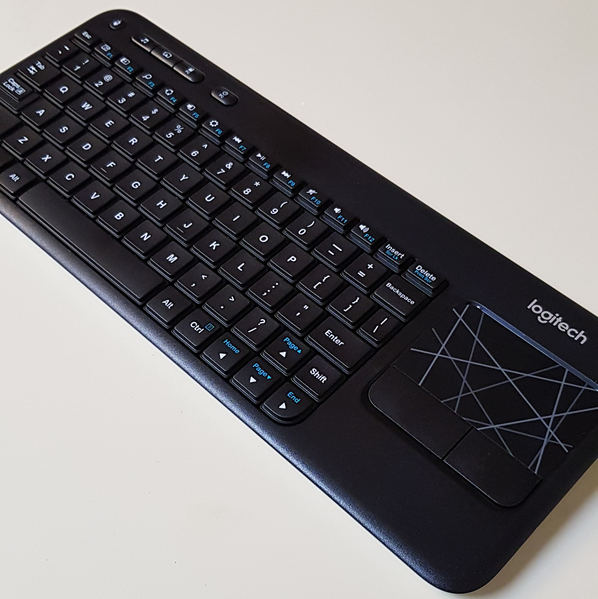

# mc-server
A portable server solution for [Minecraft](https://www.minecraft.net/)

## Table of Contents
1. [Goal](#goal)
2. [Hardware](#hardware)
3. [Software](#software)

## Goal 
The purpose of this project is to create a self-sufficient portable Minecraft server on an independently controlled piece of hardware. Modern Minecraft servers are usually hard to manage because the host server is unable to stay online 24/7, or, when run with other programs, slow down the server. Backing up is also a prominent issue, and a lot of data is lost due to crashes, malfunctions, or poor online ediquette from users.

With this solution, I hope to create a standalone portable server that runs freely of any other programs, allowing the server full control of the memory and cpu. This standalone solution only needs power and internet, and backups for the previous six months will stored once every week.

## Hardware 

The server hardware consists of the following products:

- [Raspberry Pi 4 Computer Model B (4GB RAM)](https://www.raspberrypi.org/products/raspberry-pi-4-model-b/) - $50
  
  

- Raspberry Pi USB-C Power Supply - $8

  

- Adafruit [4340] Aluminum Metal Heatsink Raspberry Pi 4 Case with Dual Fans - $25

  

- Raspberry Pi Micro HDMI Cable - $9

  

- Verbatim microSDXC With Adapter (64GB) - $9

  

- Raspberry Pi Black Case - $5

  

- Logitech K400 Wireless Touch Keyboard - $20

  

Note that this list of products does not include an ethernet cable or an HDMI display, both of which I already owned.

The steps below are the steps I followed to setup up the Raspberry Pi.

1. Screw the fans down into the heat sink. 

## Software 

The steps below are the steps I followed to setup up the operating system, backups, and start the server.

1. Go to [raspberrypi.org](https://www.raspberrypi.org/) and 