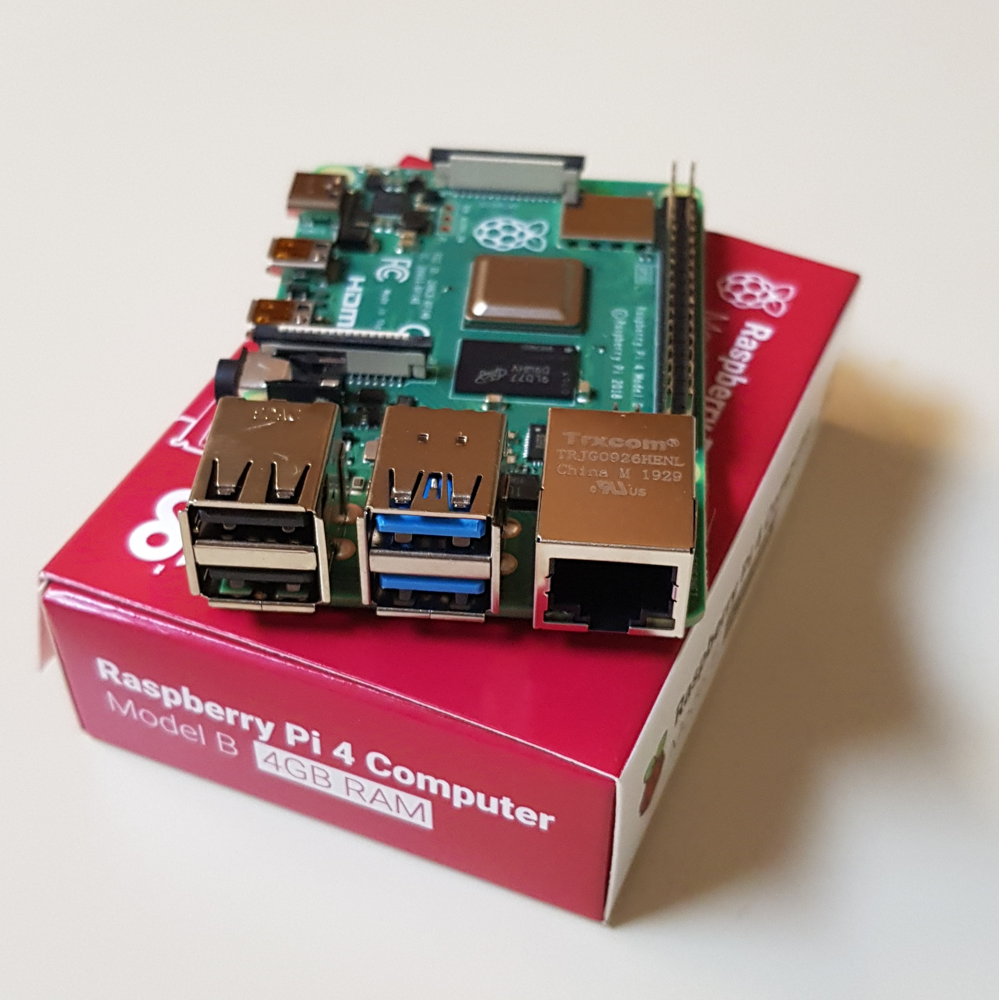
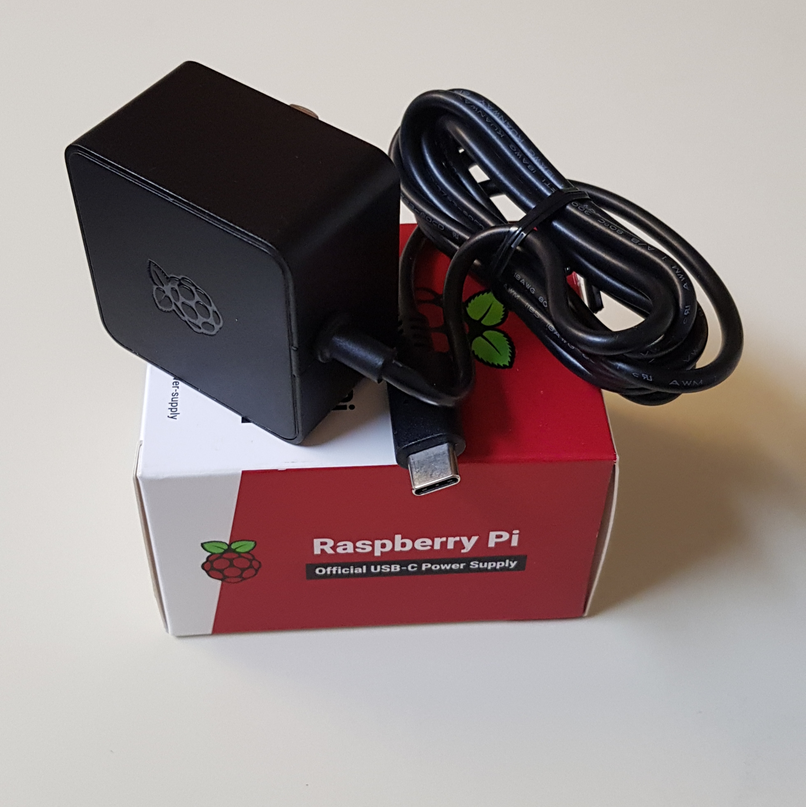
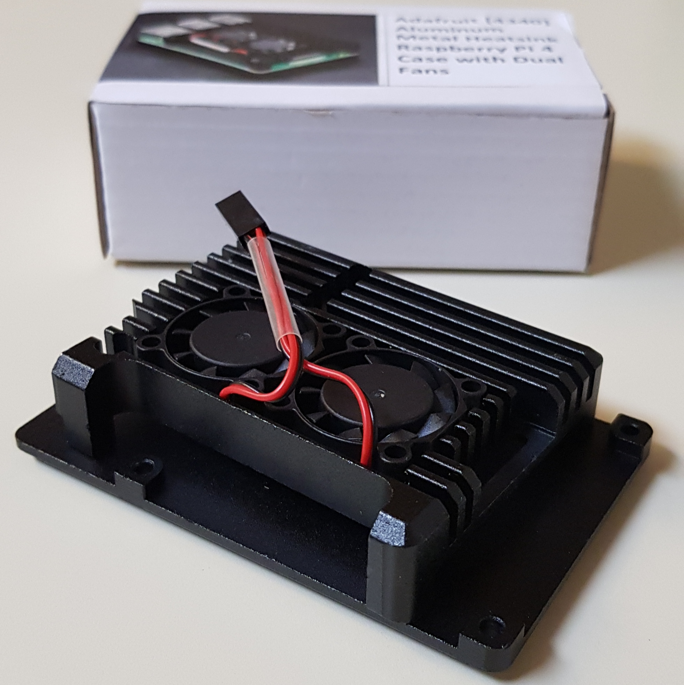
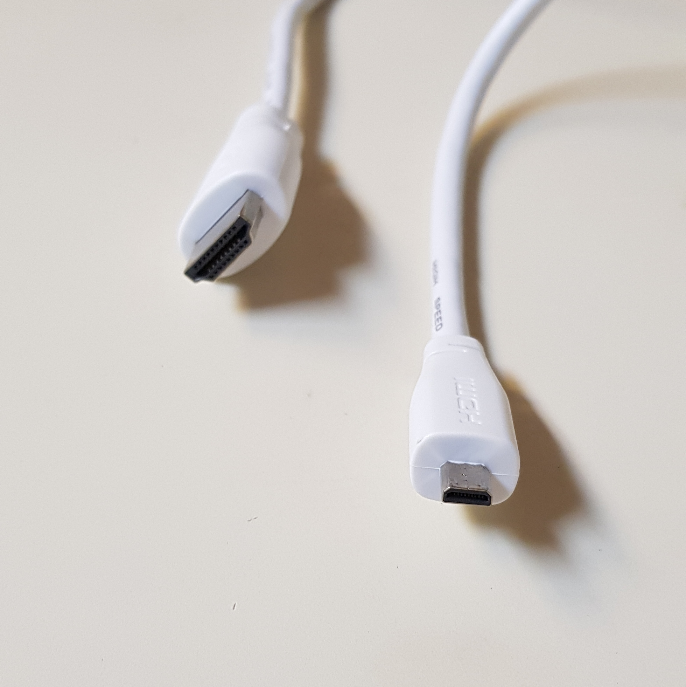
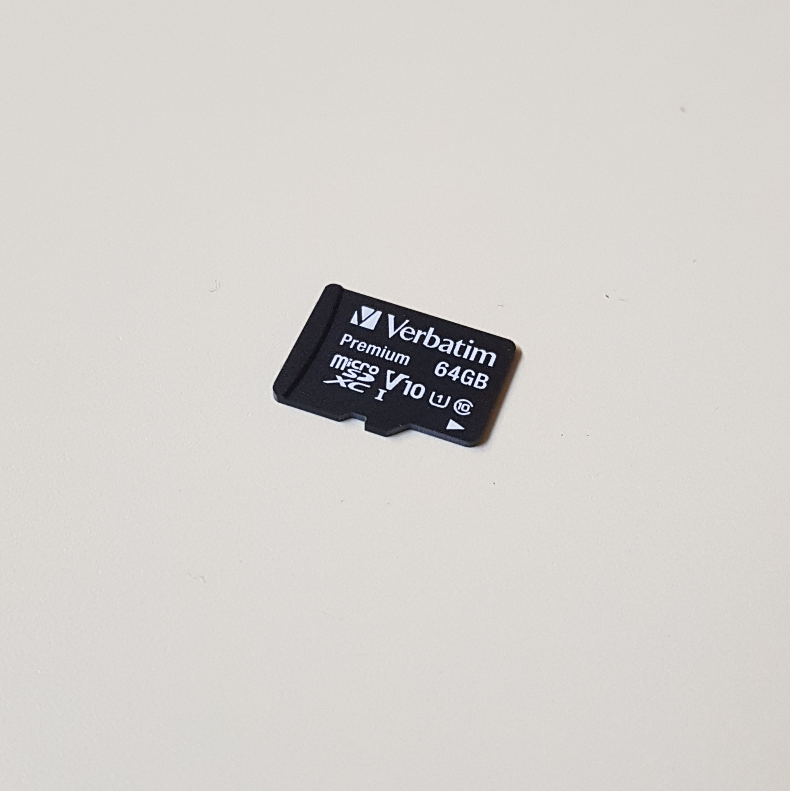
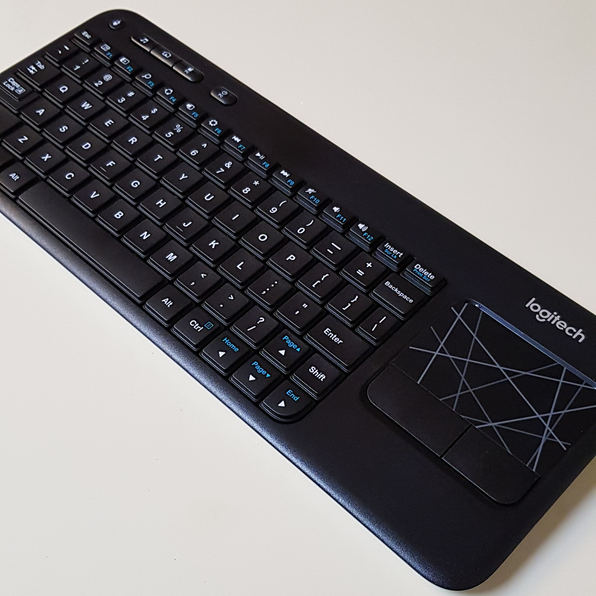
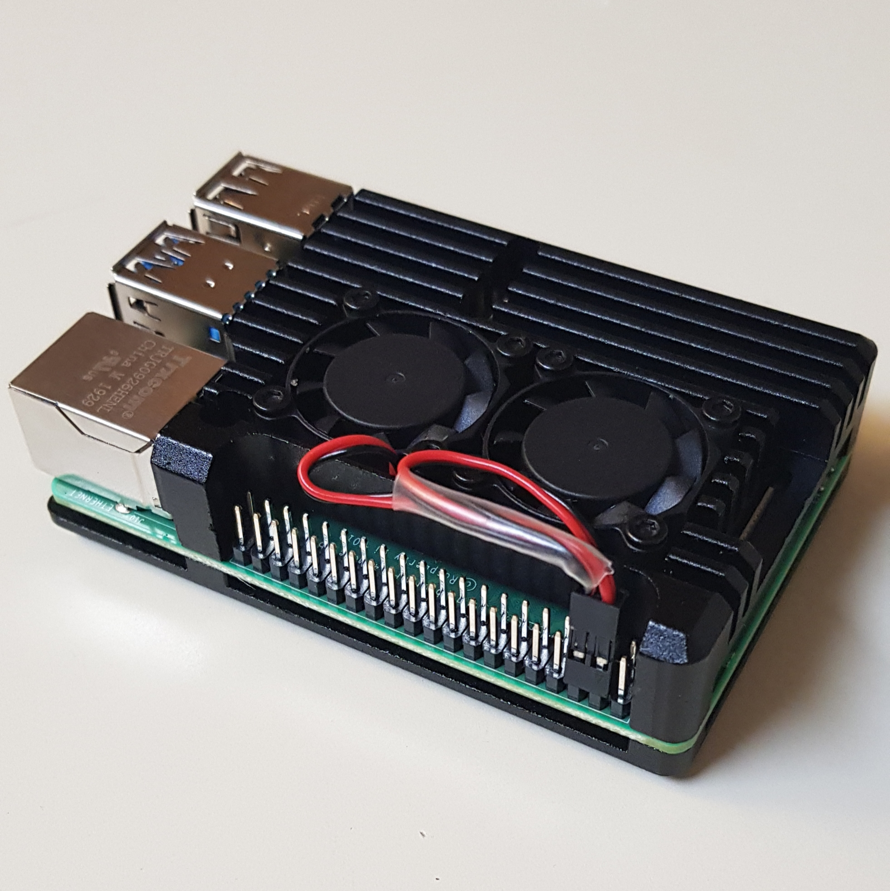
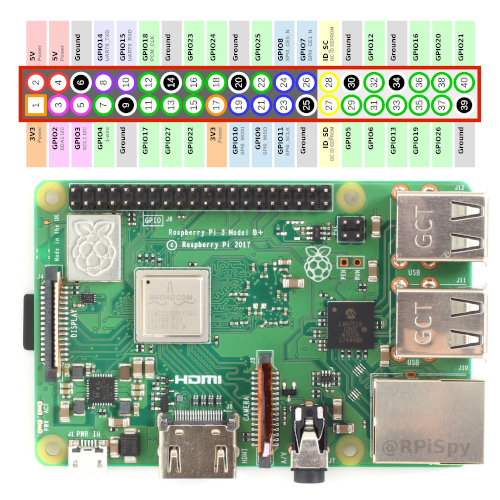

## Hardware

The server hardware consists of the following products. Including tax, the total cost was around $135.

> Note that this list of products does not include an ethernet cable or an HDMI display, both of which I already owned.

> I also purchased a standard Raspberry Pi Black Case for $5, which, to my dismay, does not fit the heat sink.

- [Raspberry Pi 4 Computer Model B (4GB RAM)](https://www.raspberrypi.org/products/raspberry-pi-4-model-b/) - $50
  
  

- Raspberry Pi USB-C Power Supply - $8

  

- Adafruit [4340] Aluminum Metal Heatsink Raspberry Pi 4 Case with Dual Fans - $25

  

- Raspberry Pi Micro HDMI Cable - $9

  

- Verbatim microSDXC With Adapter (64GB) - $9

  

- Logitech K400 Wireless Touch Keyboard - $20

  

The steps below are the steps I followed to setup up the Raspberry Pi.

1. Screw the fans down into the heat sink. It's important to notice that there are two types of screws. The flatter-head screws are used to attach the fans to the heat sink.

2. Place the thermal pads on the cpu.

    

3. Screw the heat sink and the base into the Pi. The fan pins connect to power and ground, respectively.

    
    
